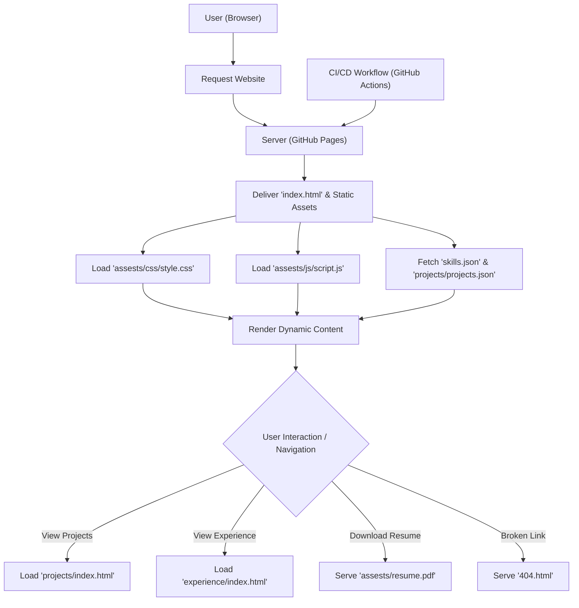

# 🚀 Dynamic Personal Portfolio Website

<p align="center"></p>

## Short Description
Unleash your professional presence with this sleek, modern, and highly customizable personal portfolio website. Crafted using the foundational pillars of web development—HTML, CSS, and JavaScript—this project offers a dynamic platform to showcase your projects, highlight your skills, and detail your professional journey. Engineered for easy content management via JSON and fortified with robust CI/CD pipelines, it's the perfect launchpad for your online professional identity.

## ✨ Key Features
*   **Stunning UI/UX:** Experience a captivating and responsive design meticulously built with HTML5, CSS3, and JavaScript, ensuring a flawless look and feel across all devices.
*   **Dynamic Content Loading:** Effortlessly update your skills and projects via intuitive JSON configuration files (`skills.json`, `projects/projects.json`), eliminating the need for code changes.
*   **Comprehensive Showcase:** Dedicated, well-structured sections to brilliantly display your portfolio projects, enumerate your technical skills, and chronicle your professional experience.
*   **Seamless Engagement:** Includes a clear call-to-action for contact and direct access to your downloadable resume (`assests/resume.pdf`) for potential opportunities.
*   **Automated Deployment:** Leverages GitHub Actions (`.github/workflows/ci-cd.yml`) for a streamlined Continuous Integration and Deployment workflow, ensuring your updates go live with ease.
*   **Interactive Visuals:** Enhanced with `particles.min.js` to add engaging, dynamic visual effects that captivate visitors.
*   **Graceful Error Handling:** A custom-designed 404 page ensures a polished user experience even when navigating to non-existent pages.

## Who is this for?
This project is an essential tool for **developers, designers, freelancers, and any professional** looking to establish a strong online presence. It's ideal for those who want to:
*   Present their work and achievements to prospective employers or clients.
*   Maintain an up-to-date and easily manageable online resume.
*   Demonstrate their web development proficiency with a self-built platform.
*   Stand out in a competitive landscape with a professional and engaging portfolio.

## Technology Stack & Architecture
This portfolio is built on a robust and modern stack, prioritizing performance, maintainability, and visual appeal:

*   **Frontend Core:** HTML5, CSS3, JavaScript
*   **Dynamic Interactivity:** Leveraging standard JavaScript for core logic, complemented by external libraries like `particles.min.js` for engaging visual effects.
*   **Content Management:** JSON files (`skills.json`, `projects/projects.json`) serve as the lightweight data layer for easily updating portfolio content.
*   **Version Control:** Git
*   **Continuous Integration/Deployment (CI/CD):** GitHub Actions (`.github/workflows/ci-cd.yml`) automate testing and deployment processes.
*   **Development Environment:** Configured for VS Code (`.vscode/settings.json`) to ensure a consistent development experience.

## 📊 Architecture & Database Schema
This portfolio operates as a static website with dynamic content loaded from local JSON files. Below is a high-level flowchart illustrating the content delivery and user interaction flow:



## ⚡ Quick Start Guide
Getting your local copy up and running is straightforward:

1.  **Clone the Repository:**
    ```bash
    git clone https://github.com/Dinu4273/portfolio_website.git
    ```
2.  **Navigate to the Project Directory:**
    ```bash
    cd portfolio_website
    ```
3.  **Open in Browser:**
    Simply open the `index.html` file in your preferred web browser to view the portfolio.
    ```bash
    # Example for macOS
    open index.html
    # Example for Windows
    start index.html
    ```
4.  **Customize Your Content:**
    Edit `skills.json` and `projects/projects.json` to reflect your personal skills and portfolio items. Update images in `assests/images/` and your resume in `assests/resume.pdf`.

## 📜 License
This project is licensed under the terms defined in the [LICENSE](LICENSE) file.